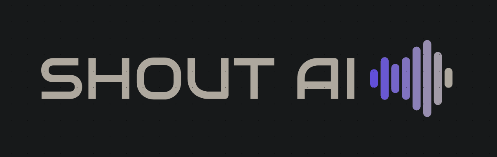
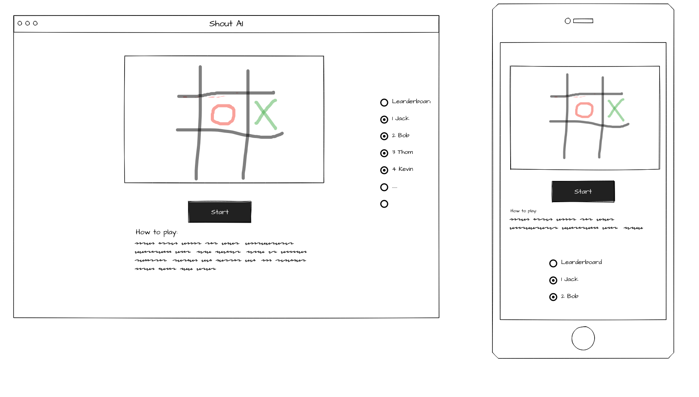
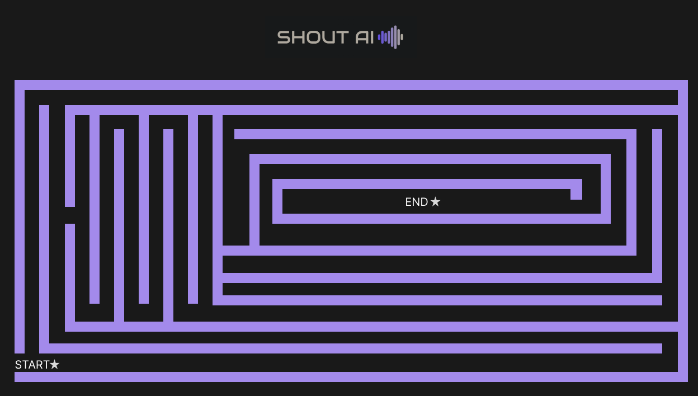
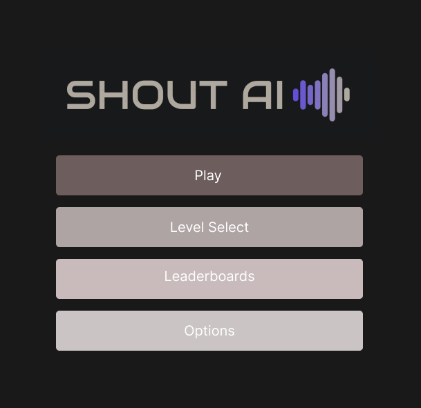

# Shout AI!
 ## Problem statement
A game where you write or shout at your computer to command your AI minion to perform a task and get the best score. 
 ## How do you solve the problem?
We use tensorflowjs combined with speach and handwriting recongztion models. Svelte as our frontend technology along with tailwind/bootstrap css, phaser 2d/pixiJS. Along with using firebase tools.  
 ## List of all the features that your team will implement. Your team will be held accountable for the features you list!
 * speach recongization 
 * hand writing recongization 
 * AI movement
 * frontend UI
 * leader board

 ## What data will your prototype be using and collecting
 * voice data
 * User timing
 * user play data
 * google analytics
 ## Any algorithms or special techniques that will be necessary
 * TensorflowJS
 * Deep learning algorithms for speach and writing recongization 

 ## Wireframe
 Initial designs:

 

credit to: Wei Zhang 

credit to: Emmet Hayes

## technology
    - firebase/google cloud
    - svelte, tensorflowjs, PixiJS/phaser 2D
    - backend: either  flask/fastapi (py) ktor(kotlin) pocketbase (go) 
    - database: surrealDB/MYsql/firestore

## font links
    logo like
    * https://fonts.google.com/specimen/Audiowide?category=Sans+Serif,Display,Monospace
    for fun font
    * bit game like https://fonts.google.com/specimen/Silkscreen?category=Sans+Serif,Display,Monospace
